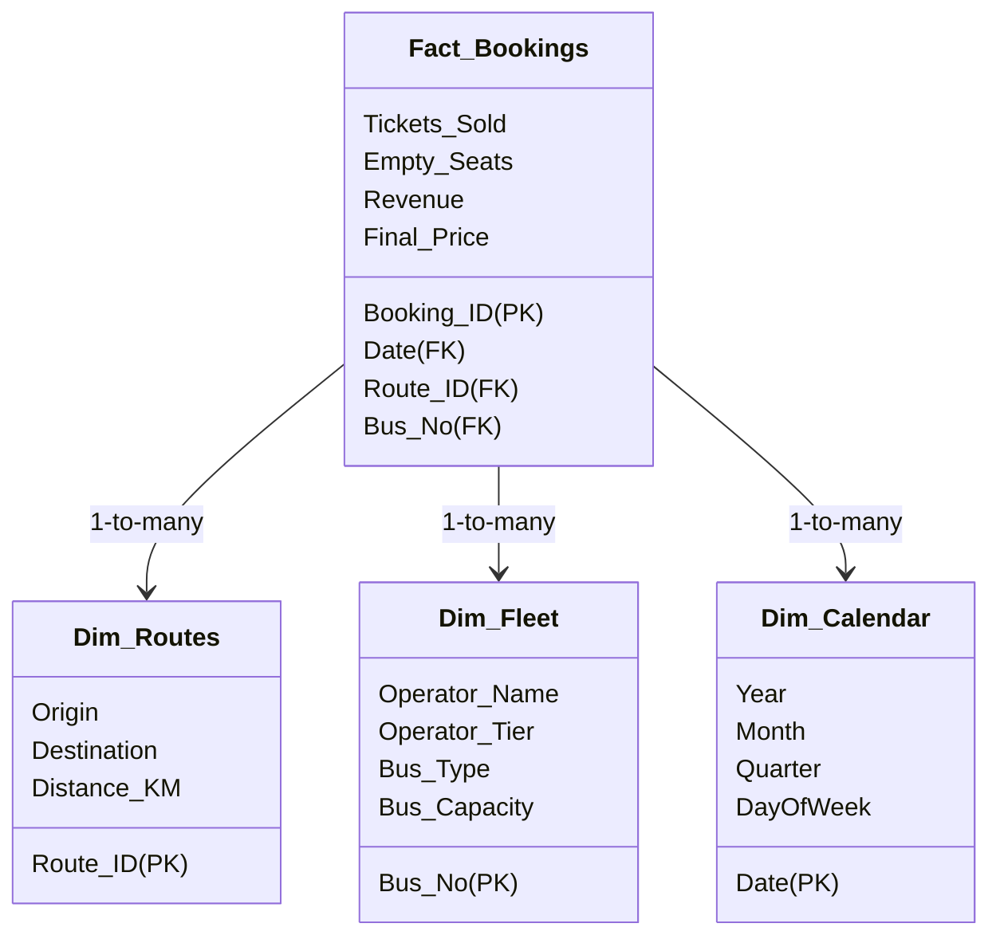

# 📊 OmniRoute AI - Enterprise Power BI Analytics & Dashboard Guide

Welcome to the ultimate guide for building a professional-grade **Power BI Executive Dashboard** using the OmniRoute AI codebase and database. This guide is designed to help you explore and master advanced Power BI features (Data Modeling, M-Code, DAX, Time Intelligence, What-If Parameters, and Row-Level Security) so you can speak confidently about them in interviews and impress recruiters.

---

## 🚀 1. Data Connectivity & Power Query (M Code)

To build a real-world enterprise dashboard, we need to ingest the data correctly and clean it.

### A. ODBC Connection
1. Download and install the **SQLite ODBC Driver** from [http://www.ch-werner.de/sqliteodbc/](http://www.ch-werner.de/sqliteodbc/).
2. Open **Power BI Desktop**, click **Get Data** -> **More...** -> Search for **ODBC**.
3. In the Data Source Name (DSN) dropdown, select `SQLite3 Datasource`.
4. Click **Advanced Options** and type the connection string pointing to your local database:
   ```text
   Database=d:\Projects\OmniRoute\data\omniroute.db
   ```
5. Click **OK**, and select the tables to import:
   - `Dim_Routes`
   - `Dim_Fleet`
   - `Fact_Bookings`

### B. Enterprise Best Practice: File Path Parameter
Instead of hardcoding the SQLite database path, create a **Parameter** in Power Query:
1. Inside Power Query Editor, click **Manage Parameters** -> **New Parameter**.
2. Name it `DBPath`, set Type to `Text`, and Current Value to `d:\Projects\OmniRoute\data\omniroute.db`.
3. In your Source step in M code, reference this parameter:
   ```powerquery
   Odbc.DataSource("dsn=SQLite3 Datasource;Database=" & DBPath, [CreateNavigationProperties=true])
   ```
*Interview Value:* "I parameterized the database connection string in Power Query, allowing seamless switching between local development, staging, and production environments."

---

## 📐 2. Star Schema & Data Modeling

Go to the **Model View** in Power BI. You will build a **Star Schema**, which is standard for analytical warehousing.



### Creating the Dim_Calendar Table (DAX)
Never use the default auto-date/time feature in Power BI as it bloats files and limits time intelligence.
1. Go to **Table Tools** -> **New Table**.
2. Input the following DAX:
   ```dax
   Dim_Calendar = 
   ADDCOLUMNS (
       CALENDAR(MIN(Fact_Bookings[Date]), MAX(Fact_Bookings[Date])),
       "Year", YEAR([Date]),
       "YearMonth", FORMAT([Date], "YYYY-MM"),
       "MonthName", FORMAT([Date], "MMMM"),
       "MonthNo", MONTH([Date]),
       "Quarter", "Q" & FORMAT([Date], "Q"),
       "DayOfWeek", FORMAT([Date], "dddd"),
       "DayOfWeekNo", WEEKDAY([Date], 2)
   )
   ```
3. Mark it as a **Date Table** by right-clicking it -> **Mark as date table** -> Select `Date`.
4. Connect `Dim_Calendar[Date]` to `Fact_Bookings[Date]` (1-to-Many).

---

## 🧮 3. Advanced DAX Measures (10+ Metrics)

Click **New Measure** on the `Fact_Bookings` table. Use these DAX formulas to build your analytics engine:

### 1. Total Revenue
```dax
Total Revenue = SUM(Fact_Bookings[Revenue])
```

### 2. Fleet Occupancy Rate
Calculates what percentage of your active capacity is actually carrying paying passengers.
```dax
Occupancy Rate % = 
DIVIDE(
    SUM(Fact_Bookings[Tickets_Sold]), 
    SUMX(Fact_Bookings, RELATED(Dim_Fleet[Bus_Capacity])),
    0
)
```

### 3. AI Dynamic Pricing Revenue Lift (The ROI Metric)
Calculates exactly how much extra money was generated by the dynamic surge pricing model compared to if the operators sold tickets at the flat standard `Base_Price`.
```dax
AI Revenue Lift (₹) = 
SUM(Fact_Bookings[Revenue]) - 
SUMX(Fact_Bookings, Fact_Bookings[Tickets_Sold] * Fact_Bookings[Base_Price])
```

### 4. Wasted Operational Cost (Empty Seats Penalty)
Assuming a static baseline loss of ₹150 per empty seat in wasted fuel and operational costs:
```dax
Wasted Operational Cost = SUM(Fact_Bookings[Empty_Seats]) * 150
```

### 5. Year-over-Year (YoY) Revenue Growth
Time Intelligence metric that compares the current period's revenue to the exact same period last year.
```dax
YoY Revenue Growth = 
VAR PrevYearRevenue = CALCULATE([Total Revenue], SAMEPERIODLASTYEAR(Dim_Calendar[Date]))
RETURN
DIVIDE([Total Revenue] - PrevYearRevenue, PrevYearRevenue, 0)
```

### 6. 30-Day Rolling Revenue Average
Smooths out weekend spikes and weekday drops to show true demand trends.
```dax
30-Day Rolling Revenue = 
AVERAGEX(
    DATESINPERIOD(Dim_Calendar[Date], LASTDATE(Dim_Calendar[Date]), -30, DAY),
    [Total Revenue]
)
```

### 7. Dynamic Price Elasticity Coefficient
Shows how passenger demand changes with ticket price shifts.
```dax
Price Elasticity = 
VAR AvgPriceChange = DIVIDE(AVERAGE(Fact_Bookings[Final_Price]) - AVERAGE(Fact_Bookings[Base_Price]), AVERAGE(Fact_Bookings[Base_Price]))
VAR DemandChange = DIVIDE(AVERAGE(Fact_Bookings[Tickets_Sold]) - AVERAGE(Fact_Bookings[Bus_Capacity]), AVERAGE(Fact_Bookings[Bus_Capacity]))
RETURN
DIVIDE(DemandChange, AvgPriceChange, 0)
```

### 8. Total Active Routes
```dax
Active Routes Count = DISTINCTCOUNT(Fact_Bookings[Route_ID])
```

### 9. Top-Performing Route (Dynamic Name)
Displays the name of the route that generated the most revenue in the selected filter context.
```dax
Top Route by Revenue = 
FIRSTNONBLANK(
    TOPN(1, VALUES(Dim_Routes[Origin] & " -> " & Dim_Routes[Destination]), [Total Revenue]),
    1
)
```

---

## 🎨 4. Professional Visuals & UX Design Patterns

### A. Decomposition Tree (The Root-Cause Visual)
* **Analyze:** `Wasted Operational Cost`
* **Explain By:** `Dim_Fleet[Operator_Name]`, `Dim_Routes[Origin]`, `Dim_Fleet[Bus_Type]`
* *Interview Value:* "In our business review sessions, managers use the Decomposition Tree to drill from country/state level down to individual bus types to locate exactly where underutilized assets are burning cash."

### B. What-If Parameter: Fuel & Tariff Hike Simulator
Let executives simulate how a flat ticket price hike impacts overall revenue.
1. Go to the **Modeling** tab -> **New Parameter** -> **Numeric Range**.
2. Name: `Tariff Increase`, Minimum: `0`, Maximum: `100`, Increment: `5`, Default: `10`.
3. Power BI will auto-generate a slider and a measure. Now, create a simulated revenue metric:
   ```dax
   Simulated Revenue = 
   [Total Revenue] * (1 + DIVIDE([Tariff Increase Value], 100))
   ```
4. Build a line chart comparing `Total Revenue` (Actual) vs `Simulated Revenue` across months.

### C. Bookmarks & Toggles (Dark Mode & View Swapping)
1. Add a **Button** (e.g., Navigator or Bookmark button).
2. Set up the **Selection Pane** and **Bookmark Pane** (from View ribbon).
3. Create two bookmarks:
   - **Bookmark 1: Chart View** (Show charts, hide detail tables).
   - **Bookmark 2: Grid View** (Hide charts, show raw tabular details).
4. Assign the bookmarks to your toggle button action.
*Interview Value:* "I implemented Bookmarks and Selection Pane triggers to build a clean UI that lets executives switch between high-level visual charts and low-level tabular exports without cluttering the screen."

---

## 🔒 5. Row-Level Security (RLS) - Enterprise Multi-Tenant

To prove you understand data privacy and corporate compliance:
1. Go to **Modeling** tab -> **Manage Roles**.
2. Create a Role named `SRM_Travels_Manager`.
3. Filter the `Dim_Fleet` table with this DAX expression:
   ```dax
   [Operator_Name] = "SRM Travels"
   ```
4. Click **View as** -> Select `SRM_Travels_Manager`.
*Verify:* The entire dashboard's numbers will shrink, showing only SRM Travels data and hiding NueGo, KPN, etc.

*Interview Value:* "I configured Row-Level Security (RLS) to support a multi-tenant business model. A regional transit operator logging in will only see their own fleet performance and ticket metrics, while global administrators see the aggregated state-wide revenue."

---

## 💬 6. How to Talk About This in an Interview (Cheat Sheet)

When an interviewer asks: *"Tell me about a time you worked with data visualization or built a dashboard."*

**Use the STAR Method:**

* **Situation:** "For our B2B transit analytics project, operators were losing revenue due to sub-optimal fleet deployment and empty return-trips, while also struggling to set optimal surge prices during holidays."
* **Task:** "I was tasked with creating an end-to-end data pipeline feeding a Power BI executive dashboard representing 2.6 million historical booking records (from 2016 to today)."
* **Action:** "I established a Star Schema connection to the SQLite database via ODBC, modeled a custom DAX Date calendar table, and authored key metrics like **AI Revenue Lift** and **Price Elasticity** to track ROI. I also implemented advanced interactive patterns like dynamic drill-throughs, what-if sliders for pricing simulations, and role-based row-level security (RLS) to isolate operator tenant data."
* **Result:** "The dashboard empowers fleet operators to identify underperforming routes in 3 clicks, showing them that the Dynamic Pricing model drove an **AI Revenue Lift of over 12%** while reducing wasted seat capacity."
